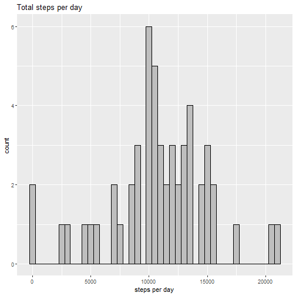
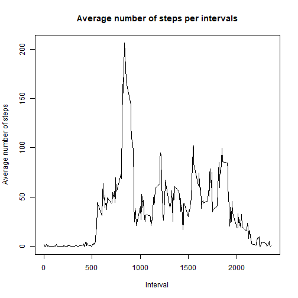
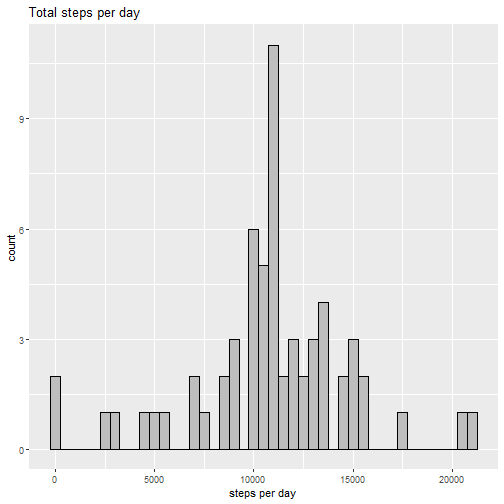
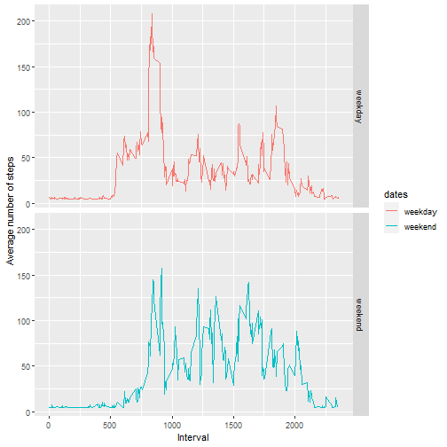

## Loading and preprocessing the data


```r
filezip <- "CourseraData.zip"
fileUrl <- "https://d396qusza40orc.cloudfront.net/repdata%2Fdata%2Factivity.zip"
download.file(fileUrl, filezip)
"Activity monitoring Data" <- unzip(filezip)
activity <- read.csv("activity.csv")
head(activity)
```

```
##   steps       date interval
## 1    NA 2012-10-01        0
## 2    NA 2012-10-01        5
## 3    NA 2012-10-01       10
## 4    NA 2012-10-01       15
## 5    NA 2012-10-01       20
## 6    NA 2012-10-01       25
```

## What is mean total number of steps taken per day?

### Calculate the total number of steps taken per day


```r
Sys.setlocale("LC_TIME", "English")
```

```
## [1] "English_United States.1252"
```

```r
steps_per_day <- aggregate(steps~date, activity, sum)
```

### Make a histogram of the total number of steps taken each day


```r
library(ggplot2)
qplot(steps_per_day$steps, xlab = "steps per day", ylab = "count", main = "Total steps per day", binwidth = 500, fill = I("grey"), col = I("black"))
```



### Calculate and report the mean and median of the total number of steps taken per day


```r
mean(steps_per_day$steps, na.rm = TRUE)
```

```
## [1] 10766.19
```

```r
median(steps_per_day$steps, na.rm = TRUE)
```

```
## [1] 10765
```


## What is the average daily activity pattern?

### A time series plot (i.e. type = "l") of the 5-minute interval (x-axis) and the average number of steps taken, averaged across all days (y-axis)


```r
average_activity_intervals <- aggregate(activity$steps, by=list(activity$interval), FUN = mean, na.rm = TRUE)
plot(average_activity_intervals, type = "l", col = "black", lwd = 1, xlab = "Interval", ylab = "Average number of steps", main = "Average number of steps per intervals")
```



### Which 5-minute interval, on average across all the days in the dataset, contains the maximum number of steps?


```r
average_activity_intervals[which.max(average_activity_intervals[, 2]), 1]
```

```
## [1] 835
```

## Imputing missing values 

### Calculate and report the total number of missing values in the dataset


```r
missing_data <- sum(is.na(activity[, 1]))
```

### Devise a strategy for filling in all of the missing values in the dataset and create a new dataset that is equal to the original dataset but with the missing


```r
library(Hmisc)
```

```
## Le chargement a nécessité le package : lattice
```

```
## Le chargement a nécessité le package : survival
```

```
## Le chargement a nécessité le package : Formula
```

```
## 
## Attachement du package : 'Hmisc'
```

```
## Les objets suivants sont masqués depuis 'package:base':
## 
##     format.pval, units
```

```r
activity_missingData <- activity
activity_missingData$steps <- impute(activity$steps, fun = mean)
head(activity_missingData)
```

```
##     steps       date interval
## 1 37.3826 2012-10-01        0
## 2 37.3826 2012-10-01        5
## 3 37.3826 2012-10-01       10
## 4 37.3826 2012-10-01       15
## 5 37.3826 2012-10-01       20
## 6 37.3826 2012-10-01       25
```

### Make a histogram of the total number of steps taken each day


```r
steps_per_day_missing <- aggregate(steps ~ date, activity_missingData, sum)
library(ggplot2)
qplot(steps_per_day_missing$steps, xlab = "steps per day", ylab = "count", main = "Total steps per day", binwidth = 500, fill = I("grey"), col = I("black"))
```




### Calculate and report the mean and median total number of steps taken per day


```r
mean(steps_per_day_missing$steps)
```

```
## [1] 10766.19
```

```r
median(steps_per_day_missing$steps)
```

```
## [1] 10766.19
```

### Do these values differ from the estimates from the first part of the assignment? 

We can notice that imputing the missing data slightly increases the median (from 10765 to 10766.19). Also the mean and the median become equal after imputing the missing data.

### What is the impact of imputing missing data on the estimates of the total daily number of steps?

Imputing the missing data increased the peek on the histogram but it did not affect the interpretion of the results


## Are there differences in activity patterns between weekdays and weekends?

### Create a new factor variable in the dataset with two levels – “weekday” and “weekend” indicating whether a given date is a weekday or weekend day.


```r
activity_missingData$dates <- ifelse(as.POSIXlt(activity_missingData$date)$wday %in% c(0, 6), "weekend", "weekday")
```

### Make a panel plot containing a time series plot (i.e. type = "l") of the 5-minute interval (x-axis) and the average number of steps taken, averaged across all weekday days or weekend days (y-axis)


```r
average_steps_dates <- aggregate(steps ~ interval + dates, data = activity_missingData, mean)
ggplot(average_steps_dates, aes(interval, steps, color = dates)) + geom_line() + facet_grid(dates ~ .) + xlab("Interval") + ylab("Average number of steps") 
```



